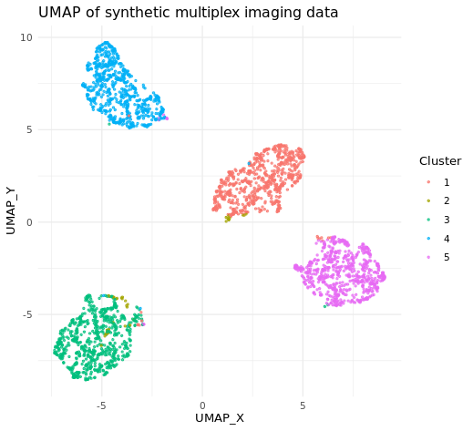

# Multiplex Imaging Analysis

A cell-level multiplex tissue imaging analysis workflow demonstrating quality control, preprocessing, unsupervised clustering, dimensionality reduction, and visualization.

This repository is a generalized portfolio implementation based on my experience analyzing multiplex tissue imaging data. Synthetic data are used to demonstrate the workflow without exposing study-specific or patient-level information.

## Workflow

1. Cell segmentation and segmentation review using QuPath
2. Cell-level quality control
3. Expression, spatial coordinate, and metadata preprocessing
4. Marker intensity transformation
5. FlowSOM-based unsupervised clustering
6. UMAP dimensionality reduction
7. Cluster interpretation and visualization

## Example Output

The figure below shows an example UMAP generated from the synthetic multiplex imaging dataset.



The synthetic dataset contains simulated cell populations with distinct marker-expression profiles and is intended solely to demonstrate the analysis workflow.

## My Contribution

- Performed cell segmentation using QuPath
- Reviewed segmentation-derived morphological features for cell-level quality control
- Developed project-specific quality-control and preprocessing steps
- Structured expression, spatial coordinate, and metadata tables for downstream analysis
- Adapted the Spectre workflow for marker transformation, FlowSOM clustering, and UMAP visualization
- Interpreted clustering results based on marker-expression patterns

## Repository Structure

```text
multiplex-imaging-analysis/
├── R/
│   ├── 00_generate_synthetic_data.R
│   ├── 01_qc_preprocessing.R
│   ├── 02_transformation.R
│   ├── 03_clustering_umap.R
│   └── 04_annotation_visualization.R
├── figures/
│   └── umap_clusters.png
└── README.md
